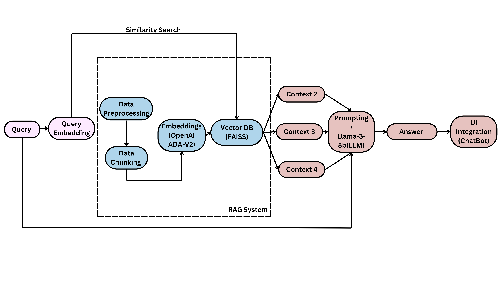

# Welcome To Boston Public School Policy Document Retrieval Chatbot

# Project Overview

The project aims to support Boston Public Schools by simplifying access to English-language public policy information through an intuitive RAG-based chatbot. Acting as a virtual assistant, the chatbot helps staff find policy-related answers and documents quickly, saving time on administrative tasks. By organizing policy documents into searchable pieces and using smart retrieval tools, it delivers accurate, clear responses through a user-friendly interface. Focusing on privacy and reliability, the chatbot enhances decision-making and streamlines navigating complex policies.

# Public Policies

The following link provides access to Boston Public Schools' official policies. These policies cover a wide range of topics, including academic guidelines, student conduct, safety protocols, and other important regulations governing the school district's operations.

You can view the complete list of policies and guidelines by visiting the link below:  
Link: [Boston Public Schools Policies](https://www.bostonpublicschools.org/domain/1884)


# Project Pipeline

# Installation Instructions  

Follow the steps below to set up and configure the environment for the chatbot:  

## Step 1: Install Required Dependencies  
Run the following command to install the necessary dependencies:  
```bash
pip install -r requirements.txt
```  

If you encounter issues with `torch` or its dependencies, use the following command to manually install the required PyTorch packages:  
```bash
pip3 install --pre torch torchvision torchaudio --extra-index-url https://download.pytorch.org/whl/nightly/cpu
```  

## Step 2: Set Up Environment Variables  
Create a `.env` file in the root directory of the project and add the following lines:  
```bash
export OPENAI_API_KEY='your-openai-api-key'
export LANGCHAIN_API_KEY='your-langchain-api-key'
export LANGCHAIN_TRACING_V2="true"
```  
Replace `'your-openai-api-key'` and `'your-langchain-api-key'` with your actual API keys.  

This application runs well for python versions> 3.8, up to the version specified in 'python_version.txt'

## Step 3: Run the Chatbot Application  
Start the chatbot by running the following command:  
```bash
uvicorn code.main:app --reload --port 8000
```  
The application will run on port `8000` by default. If you want to use a different port, replace `8000` with your preferred port number.  

## Usage  
After completing these steps, the chatbot will be accessible via the specified port. You can interact with it using the user interface or API endpoints.  

By following these instructions, you will have the chatbot configured and ready to use seamlessly.  
